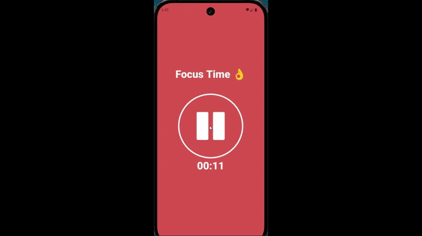

# Pomodoro App
A simple Pomodoro timer app built using React Native, Expo, and TypeScript to enhance productivity by setting timers for focused study sessions and breaks.

This project was created as part of my journey to learn TypeScript and mobile app development using React Native. I plan to improve the app further, adding new features and enhancing functionality as I deepen my understanding of React Native and TypeScript.

# 📹Demo Video
